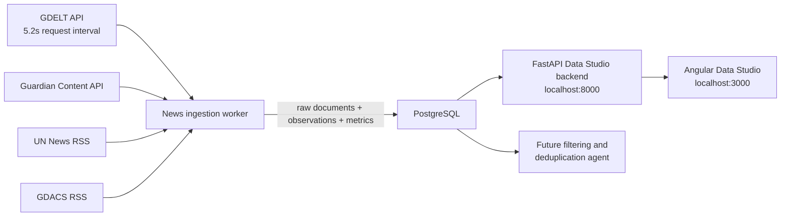

# Strategic Risk Radar

Containerized public-information ingestion PoC for strategic early warning.
The repository contains four independently buildable projects:

| Project | Responsibility |
|---|---|
| `strategic-risk-radar-news-ingestion` | Retrieve API/RSS data and record run metrics |
| `strategic-risk-radar-db` | PostgreSQL image, schema, views, and raw evidence |
| `strategic-risk-radar-data-studio-backend` | Read-only FastAPI query service |
| `strategic-risk-radar-data-studio-frontend` | Custom Angular dashboard |

## Architecture



## Data Model

- `ingestion_runs`: one row for every complete ingestion execution.
- `source_runs`: status, requested date window, counts, duration, and error.
- `keyword_run_metrics`: documents retrieved, matched, inserted, and duplicated
  for every source and keyword.
- `raw_news_items`: immutable first-seen raw documents.
- `raw_news_item_keywords`: all keywords associated with each document.
- `run_item_observations`: links every observed document to its run and source.
- `v_run_summary`: simple run-level browser view.
- `v_documents_browse`: document browser view with combined keywords.

Raw documents are saved before a future filtering agent. This preserves replay,
audit evidence, failure recovery, and measurable filtering results.

## Deploy With Docker Desktop

Copy `.env.example` to `.env` and set a strong database password. Guardian can
run with the public `test` key for early PoC work; set `GUARDIAN_API_KEY` to a
free developer key for sustained use.

```powershell
Copy-Item .env.example .env
.\bin\build-all.ps1
.\bin\deploy-all.ps1
```

Open `http://localhost:3000` to use the Angular Data Studio. Select an
ingestion run to inspect its source windows, errors, counts, and per-source
keyword results together. The read-only API and interactive documentation are
available at `http://localhost:8000/docs`.

The frontend port is bound to IPv4 loopback in `docker-compose.yml` to avoid a
Windows Docker Desktop issue where IPv6 `localhost` can connect but hang.

PostgreSQL is also exposed to the host on `localhost:5434` for tools such as
pgAdmin. Containers use the internal address `db:5432`.

The UI provides document browsing and run, source-window, and keyword views.

## GDELT Limit

GDELT receives one request per keyword group. The worker enforces a
configurable minimum interval of `5.2` seconds before every subsequent GDELT
request. If GDELT returns HTTP `429 Too Many Requests`, the worker sleeps for
`60` seconds before retrying. The deployment intentionally runs one ingestion
worker, preventing concurrent workers from violating the limit.

## Incremental Date Windows

News ingestion runs continuously every `INGESTION_INTERVAL_MINUTES` minutes,
defaulting to `1440` minutes, or 24 hours. Each source resumes from the end of its latest successful
source run. If no successful run exists, or that date is older than
`INGESTION_MAX_LOOKBACK_HOURS`, ingestion retrieves only that configured
lookback period, currently defaulting to `24` hours for source testing. Failed source windows do not advance
the latest successful window, so they can be retried.

Only English news is persisted. GDELT requests explicitly select English
sources, Guardian requests use English language filtering, and the selected RSS
feeds are English feeds.

## Project Scripts

Each project has its own `build.ps1`, `deploy.ps1`, `build.sh`, and `deploy.sh`.
The root `bin` directory builds, tests, deploys, and stops the complete stack.

Runtime containers use explicit names without Docker Compose numeric suffixes.
News ingestion remains running as a scheduler container and records a separate
database run for every scheduled cycle.

See [TRACE.md](TRACE.md) for the detailed execution trace.
