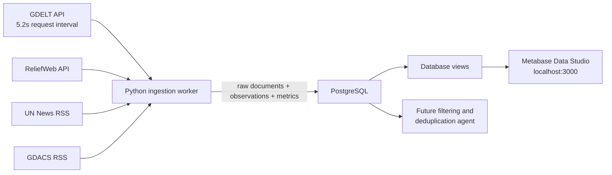

# Strategic Risk Radar

Containerized public-information ingestion PoC for strategic early warning.
The repository contains three independently buildable projects:

| Project | Responsibility |
|---|---|
| `strategic-risk-radar-python` | Retrieve API/RSS data and record run metrics |
| `strategic-risk-radar-db` | PostgreSQL image, schema, views, and raw evidence |
| `strategic-risk-radar-data-studio` | Metabase browser and dashboard interface |

## Architecture



## Data Model

- `ingestion_runs`: one row for every complete ingestion execution.
- `source_runs`: status, requests, counts, duration, and error for each source.
- `keyword_run_metrics`: documents retrieved, matched, inserted, and duplicated
  for every source and keyword.
- `raw_news_items`: immutable first-seen raw documents.
- `raw_news_item_keywords`: all keywords associated with each document.
- `run_item_observations`: links every observed document to its run and source.
- `v_run_summary`: simple run-level browser view.
- `v_documents_browse`: document browser view with combined keywords.

Raw documents are saved before a future filtering agent. This preserves replay,
audit evidence, failure recovery, and measurable filtering results.

## Deploy With Docker Desktop

Copy `.env.example` to `.env` and set a strong database password. ReliefWeb is
free but requires an approved app name.

```powershell
Copy-Item .env.example .env
.\bin\build-all.ps1
.\bin\deploy-all.ps1
```

Open `http://localhost:3000`, complete Metabase setup, then add PostgreSQL:

```text
Host: db
Port: 5432
Database: risk_radar
Username: risk_radar
Password: value from .env
```

PostgreSQL is also exposed to the host on `localhost:5434` for tools such as
pgAdmin. Containers use the internal address `db:5432`.

Browse `v_documents_browse` to inspect the data itself. Use `v_run_summary`,
`source_runs`, and `keyword_run_metrics` for operational dashboards.

## GDELT Limit

GDELT receives one request per keyword. The worker enforces a configurable
minimum interval of `5.2` seconds before every subsequent GDELT request. The
deployment intentionally runs one ingestion worker, preventing concurrent
workers from violating the limit.

## Project Scripts

Each project has its own `build.ps1`, `deploy.ps1`, `build.sh`, and `deploy.sh`.
The root `bin` directory builds, tests, deploys, and stops the complete stack.

See [TRACE.md](TRACE.md) for the detailed execution trace.
