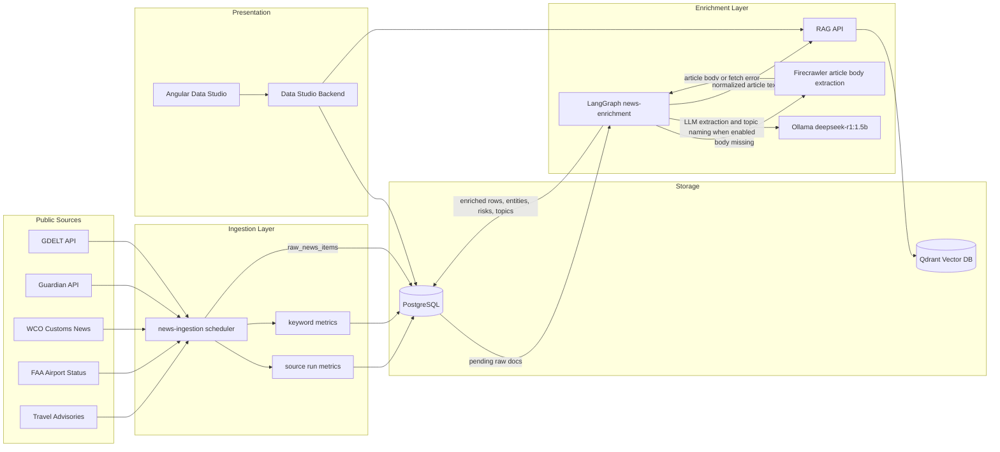
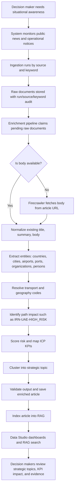
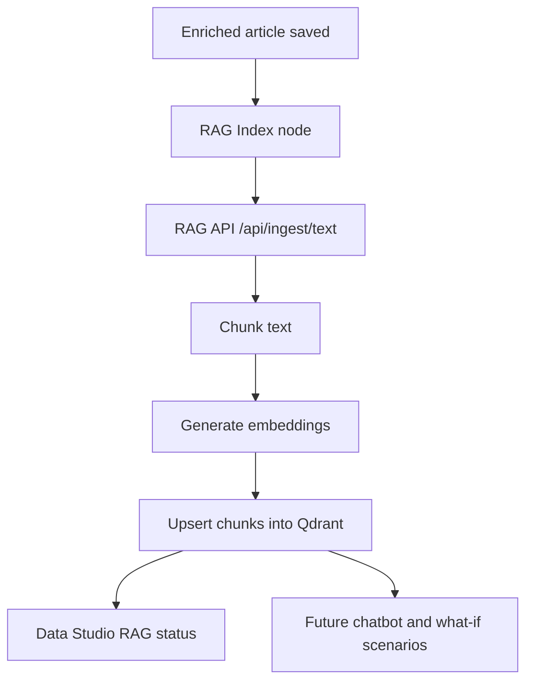
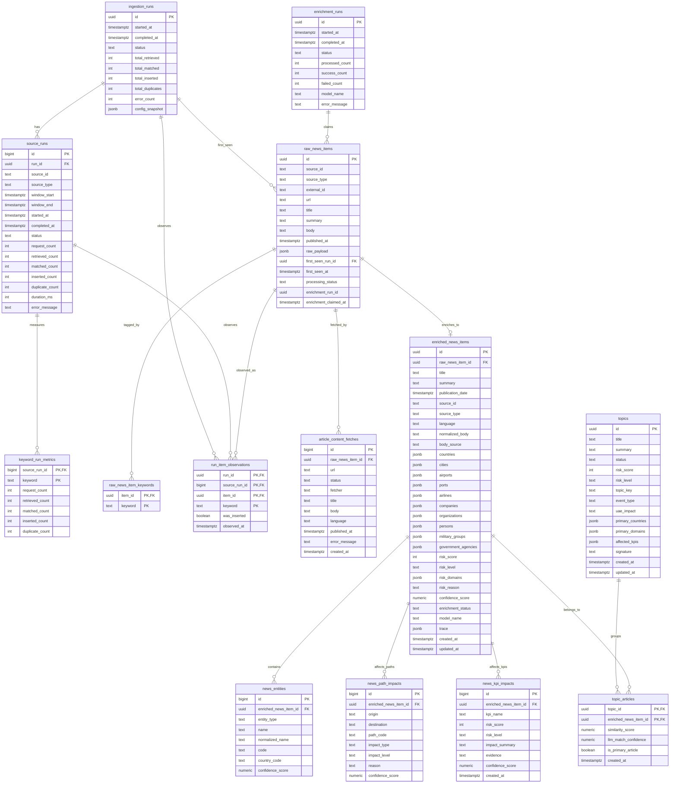

# Strategic Risk Radar System Design

## 1. Purpose

Strategic Risk Radar is a proof-of-concept decision intelligence platform for monitoring world events that may affect identity, citizenship, visa, passenger movement, cargo movement, customs, port security, airport operations, and UAE government service continuity.

The system ingests public news and operational notices, enriches them with structured risk intelligence, groups them into strategic topics, maps them to ICP-relevant KPIs, and exposes the result in Data Studio and RAG services.

## 2. Current Runtime Configuration

| Setting | Current value | Meaning |
| --- | --- | --- |
| `ENRICHMENT_BATCH_SIZE` | `2000` | Maximum raw records claimed by one enrichment cycle. |
| `ENABLE_LLM` | `true` | Enables general LLM-assisted extraction. |
| `ENABLE_TOPIC_LLM` | `true` | Enables LLM-assisted KPI impact, risk scoring, and strategic topic naming when code gates allow it. |
| `ENABLE_RAG_INDEXING` | `true` | Enriched articles are indexed into the RAG vector database. |
| `FIRECRAWLER_TIMEOUT_SECONDS` | `5` | Maximum Firecrawler fetch wait time. |
| `MODEL_REQUEST_TIMEOUT_SECONDS` | `15` | Maximum local Ollama request wait time. |
| `MODEL_NUM_PREDICT` | `120` | Maximum generated tokens per model call. |

Important operational note: with `ENABLE_LLM=true`, `ENABLE_TOPIC_LLM=true`, and batch size `2000`, enrichment can be slow because the local `deepseek-r1:1.5b` model is called repeatedly. This is useful for testing full agent behavior, but it is heavy for large backfills.

## 3. Project Structure

| Project | Purpose | Runtime |
| --- | --- | --- |
| `strategic-risk-radar-news-ingestion` | Pulls raw news from APIs and public feeds, tracks source/keyword metrics, writes raw documents. | Python container |
| `strategic-risk-radar-news-enrichment` | LangGraph enrichment pipeline that normalizes, extracts entities, scores risks, creates topics, and indexes to RAG. | Python container |
| `strategic-risk-radar-firecrawler` | Fetches article HTML and extracts readable body text when raw source has no body. | FastAPI container |
| `strategic-risk-radar-postgres-db` | Primary relational database for runs, raw documents, enriched documents, topics, and audit metrics. | PostgreSQL container |
| `strategic-risk-radar-qdrant-vector-db` | Vector database for RAG chunks. | Qdrant container |
| `strategic-risk-radar-rag-api` | Ingests text/PDF/JSON/XML into Qdrant and searches indexed knowledge. | FastAPI container |
| `strategic-risk-radar-ollama-model` | Local LLM runtime hosting `deepseek-r1:1.5b`. | Ollama container |
| `strategic-risk-radar-data-studio-backend` | Read-only API for Data Studio dashboards. | FastAPI container |
| `strategic-risk-radar-data-studio-frontend` | Angular UI for status, execution summaries, raw/enriched documents, topics, KPI impact, and RAG status. | Angular + Nginx container |

## 4. System Architecture Diagram



## 5. Business Flow



## 6. Enrichment Agent Flow

```mermaid
flowchart LR
    Load["Load Raw Article"] --> Normalize["Normalize Agent"]
    Normalize --> Entity["Entity Extraction Agent"]
    Entity --> Geo["Geo / Transport Resolver"]
    Geo --> Path["Path Impact Agent"]
    Path --> KPI["KPI Impact Agent"]
    KPI --> Risk["Risk Scoring Agent"]
    Risk --> Topic["Topic Clustering Agent"]
    Topic --> Validator["Final Validator"]
    Validator --> Save["Save Enriched Article"]
    Save --> RAG["RAG Index"]
```



## 7. Agent Responsibilities

| Agent / Node | Main responsibility | Output |
| --- | --- | --- |
| Load Raw Article | Reads a claimed raw record from PostgreSQL. | Initial enrichment state |
| Normalize Agent | Uses source body if available. If missing, calls Firecrawler. Cleans text and detects language. | `normalized_body`, `language`, `body_source` |
| Entity Extraction Agent | Extracts entities from article text. With `ENABLE_LLM=true`, can use Ollama. | countries, cities, airports, ports, airlines, companies, organizations, persons |
| Geo / Transport Resolver | Resolves known country, airport, and port codes. | ISO/IATA/UNLOCODE-like codes |
| Path Impact Agent | Creates route labels and route-risk indicators. | `news_path_impacts` |
| KPI Impact Agent | Maps the event to ICP KPIs. With `ENABLE_TOPIC_LLM=true`, can use Ollama. | `news_kpi_impacts` |
| Risk Scoring Agent | Produces article risk score, risk level, risk domains, reason, and confidence. | risk fields on `enriched_news_items` |
| Topic Clustering Agent | Attaches to existing strategic topic by topic key or creates a new one. | `topics`, `topic_articles` |
| Final Validator | Checks required fields and marks items as enriched or needs review. | `enrichment_status` |
| RAG Index | Sends enriched text to RAG API for vector indexing. | Qdrant chunks |

## 8. Data Studio Pages

| Page | Purpose |
| --- | --- |
| Home | Top statistics, ingestion summary, enrichment summary, and RAG status. |
| Ingestion Execution | Run/source/keyword execution metrics. |
| Enrichment Execution | Enrichment run list and per-agent execution summary. |
| Raw Documents | Browse raw ingested documents and full source payload. |
| Enriched Documents | Browse enriched articles and inspect agent outputs. |
| Topics | Strategic topic board with KPI impact per topic and related news. |

## 9. RAG Flow



RAG can index:

- Enriched news articles
- ICP documents and policies
- PDFs
- Text
- JSON
- XML

Recommended future use cases:

- Chatbot about current situations
- What-if scenario analysis
- Policy-aware impact explanation
- ICP procedure and regulation lookup
- Cross-linking news with internal responsibilities

## 10. Complete ERD



## 11. Main Database Views

### `v_run_summary`

Aggregates ingestion runs with source count.

### `v_documents_browse`

Provides raw document browsing with keywords, status, source, body, and publication timestamps.

## 12. Key Operational Risks

| Risk | Cause | Mitigation |
| --- | --- | --- |
| Slow enrichment | Local model is slow and batch size is high. | Use smaller batch size for LLM mode, or keep LLM disabled for bulk backfill. |
| Long claims | Worker restarted mid-cycle. | `CLAIM_TIMEOUT_SECONDS` resets stale claims. Manual reset can also be used. |
| Missing body | Source API does not include body. | Firecrawler fetches article body from URL. |
| Firecrawler delays | Some sites block or load slowly. | `FIRECRAWLER_TIMEOUT_SECONDS=5`. |
| Topic quality lower without LLM | Deterministic fallback is less expressive. | Enable topic LLM for small batches or post-process selected high-risk records. |
| RAG stale data | Enrichment reset does not clear Qdrant automatically. | Clear Qdrant collection when a full RAG rebuild is required. |

## 13. Recommended Operating Modes

### Bulk Backfill Mode

Use this when processing many old documents quickly:

```text
ENRICHMENT_BATCH_SIZE=1000-2000
ENABLE_LLM=false
ENABLE_TOPIC_LLM=false
ENABLE_RAG_INDEXING=true
```

### Intelligence Quality Mode

Use this for smaller high-value batches:

```text
ENRICHMENT_BATCH_SIZE=5-20
ENABLE_LLM=true
ENABLE_TOPIC_LLM=true
ENABLE_RAG_INDEXING=true
```

### Current Requested Mode

The system is currently configured as:

```text
ENRICHMENT_BATCH_SIZE=2000
ENABLE_LLM=true
ENABLE_TOPIC_LLM=true
```

This mode exercises the full agentic/LLM path, but it may take a long time on local `deepseek-r1:1.5b`.

## 14. Decision Maker View

Decision makers should primarily use:

- Topic board for strategic situation awareness
- KPI impact board for operational responsibilities
- Enriched document page for article-level evidence
- RAG status for knowledge readiness
- RAG chat/search in future iterations for current situation Q&A

## 15. Future Improvements

1. Add a separate LLM post-processing queue for high-risk articles only.
2. Add per-agent timing logs to identify slow nodes immediately.
3. Store explicit RAG indexing status per enriched article.
4. Add topic merge/split controls in Data Studio.
5. Add MCP server only after real external tool orchestration is needed.
6. Add internal ICP policy/document ingestion to RAG.
7. Add alert thresholds by KPI, topic, country, source, and path impact.
8. Add analyst review workflow for high-risk topics.
9. Add model selection per agent.
10. Add source reliability scoring.
